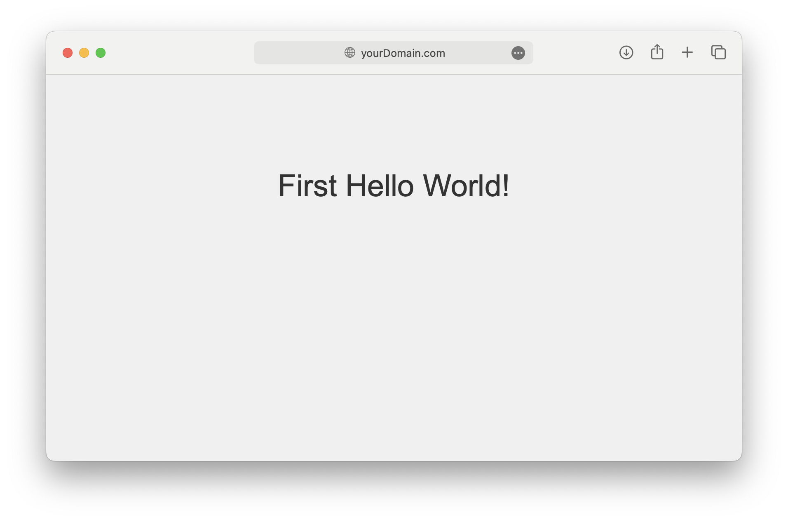

# nginx-proxy-automation
Use docker compose to automatically configure nginx, assign domain and generate ssl for your websites behind an Nginx reverse proxy with automatic SSL via Let's Encrypt.

# How to run
1. Change Example Values: Replace example.com, www.example.com, and yourEmail@mail.com with your domain and email.
2. Create Network `network create nginx-proxy` see note.
3. Start Services: `docker-compose up` to start the services.
4. DNS Setup: Point your domain DNS records to your server's IP address.
> Note: Using an external network allows for better isolation and control, ensuring the proxy works seamlessly with the web services.
